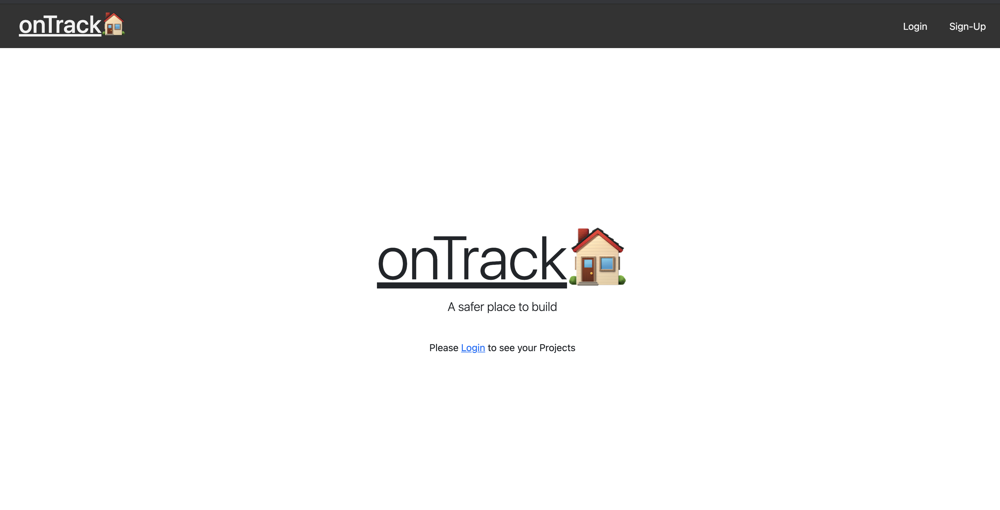

# onTrack

## Description
The construction business today still utilizes antiquated processes to keep track of, manage, and account for material use, activities, and billing, among other critical services. The onTrack application would provide general contractors with the ability to track and manage their various construction projects by adding, updating, and deleting information tied to their projects or individual project scopes (including location, cost, and progress). Additionally, homeowners can log into the application to view the latest statuses on their projects. 

## Table of Contents
  - [Description](#description)
  - [Installation](#installation)
  - [Languages and technologies used](#languages-and-technologies-used)
  - [Usage](#usage)
  - [License](#license)
  - [Contributing](#contributing)
  - [Tests](#tests)
  - [Licensing and copyright](#licensing-and-copyright)

## Installation
To launch the application, please click [here](https://sheltered-lake-23144.herokuapp.com) to view the application on the deployed Heroku site, sign in or log in to your account, and begin documenting your home or business construction journey.

## Languages and technologies used
This application utilized HTML, CSS, Javascript, Node.js, bcrypt, Cloudinary, Sequelize, Express.js, Bootstrap and jQuery.

## Usage
When visiting the site for the first time, a general contractor or homeowner can either sign up or log in with their corresponding credentials. Once logged in, the user is taken to a homepage with current projects with the option to log out at the top. The user also has the ability to view / click on existing projects and see relevant details; if the user is a general contractor, they can click on the project scope and update the description, status, or add a photo. When the user (logged in as a general contractor) clicks on the Dashboard link in the navigation, they will see all projects that they've already created with an option to add a new project.

If the user is logged in as a homeowner, they can click on a project and view its title, description and status, as well as view any photos. When the user (logged in as a homeowner) clicks on the Dashboard link, they are presented with any projects that are taking place on their property. The user (logged in as a homeowner) does not have editing capabilities.

## Contributing
- Jordan Scott: <jscott0751@gmail.com>
- Candice Wu: <candice.ying.wu@gmail.com>
- Scotty Yackzan: <syackzan@gmail.com>

## Tests
NA.

## License and copyright
(c) Jordan Scott, Candice Wu and Scotty Yackzan

Licensed under the MIT License: [click here](license).

